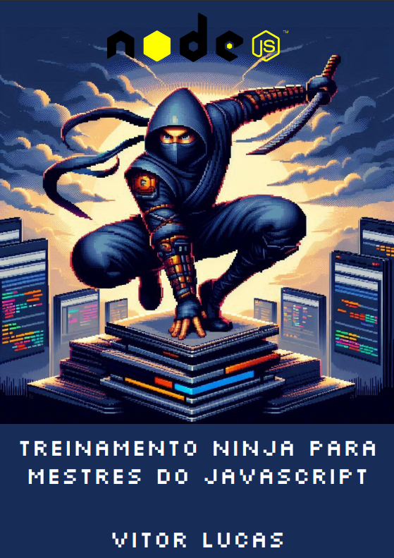

    

# Projeto EBOOK Gerado por I.A.s

## 🚀 Introdução

Projeto com o objetivo de gerar um ebook digital com as facilidades das ferramentas de IA. todos os prompts
seguem abaixo.

<a href="https://github.com/SenaVitor/lab-natty-or-not/blob/main/ebook-nodejs-desafio-dio.pdf" title="View PDF now"> 📕Clique aqui para ler</a>

### Template

## 📒 Descrição
Projeto com o objetivo de gerar um ebook digital sobre NodeJS, utilizando IA para acelerar o processo.

## 🤖 Tecnologias Utilizadas
- IA Generativa **[ChatGPT](https://chat.openai.com)** para roteirização;
- IA Generativa **[Microsoft Copilot](https://copilot.microsoft.com/images/create#)** para criar a arte visual do e-book;
- Ferramenta **[Google Apresentações](https://docs.google.com/presentation/u/0/)** para edição.

## 🧐 Processo de Criação
Utilizei Microsoft Copilot para gerar a capa do ebook, após isso, gerei o título e o conteúdo do ebook com o chatGPT, ao final revisei tudo e realizei alguns ajustes enquanto montava o ebook utilizando o Google Apresentações.  

## 🚀 Resultados
- Link para o **[Ebook](https://github.com/SenaVitor/lab-natty-or-not/blob/main/ebook-nodejs-desafio-dio.pdf)**

## 💭 Reflexão (Opcional)
Ao criar este ebook pude perceber as vantagens que as IAs nos proporcionam, acelerando o processo de criação, mas claro sempre sendo necessário revisar o conteúdo gerado.

## 🧠 Prompts

ChatGPT：

|   Ação   | Prompt                                                                                                          |
| :------: |-----------------------------------------------------------------------------------------------------------------|
|  título  | Crie um título de um ebook sobre um cronograma para aprender nodejs, focado em pessoas que já dominam javascript, o ebook é do nicho de programação e o subnicho é de nodejs/javascript, o título deve ser épico e curto, e tenha uma temática de Naruto no título, me liste 5 variações de títulos |
| conteúdo | Faça um texto para ebook, com foco em Node JS, listando os principais princípios, tanto simples quanto avançados, com exemplos em código (REGRAS) Explique sempre de uma maneira simples, Deixe o texto enxuto, Sempre traga exemplos de código em contextos reais, Sempre deixe um título sugestivo por tópico |

Microsoft Copilot：

|  Ação  | Prompt                                                                                 |
| :----: | -------------------------------------------------------------------------------------- |
| imagem | A ninja in an epic pose, master in the art of Node JS and Javascript, pixel art style |
